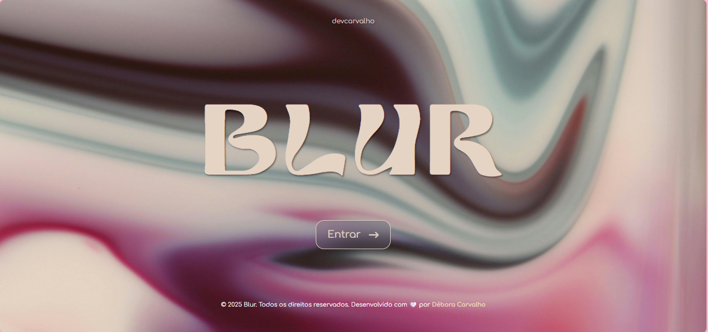
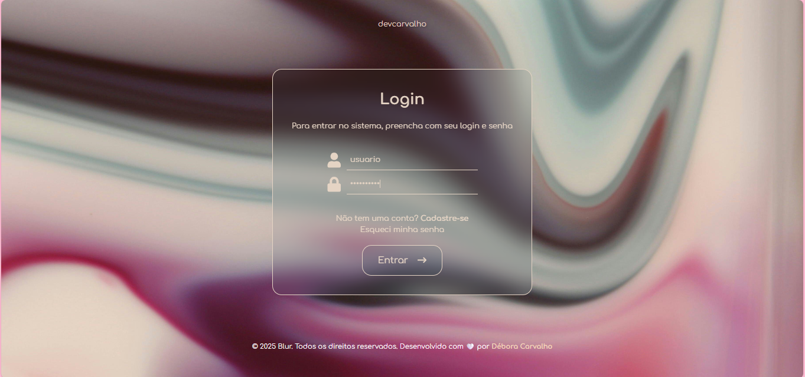
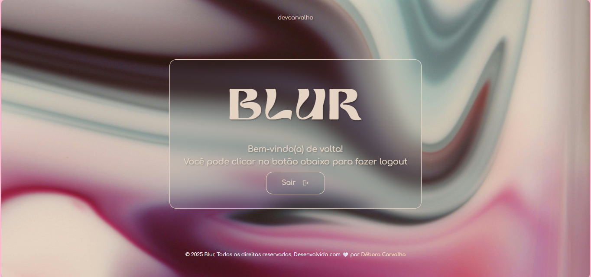

# ✨ Blur

Projeto desenvolvido em React.js simulando a funcionalidade de login/logout através de uma estrutura simples de IF/ELSE. Elaborado para a disciplina de Desenvolvimento Web III.


## Screenshots








## Rodando localmente

Clone o projeto

```bash
  git clone https://github.com/Debora-Carvalho/dsw-projeto-login.git
```

Entre no diretório do projeto

```bash
  cd dsw-projeto-login
```

Instale as dependências

```bash
  npm install
```

Inicie o servidor

```bash
  npm run start
```


## Desenvolvido por:

- [@Debora-Carvalho](https://github.com/Debora-Carvalho)

📅 **Desenvolvido em:** Maio/2025